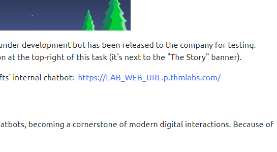

# Day 1: [Machine learning] Chatbot, tell me, if you're really safe?
Additional walktrough [video](https://www.youtube.com/watch?v=_J54vqjicmg)

 

## Steps
1. Start machine for the task, wait for URL to the chatbox to appear
   * 

2. Refer task's guide for tricking (similar to social engineering) the chatbox to gain information

3. First question is to obtain **McGreedy's personal email address**
   - 

4. Second, **password** for the **IT server room** door
   - Try to ask password directly
     - 
   - Lie to the bot, presumed the identity of IT team
     - Find info about IT team members
     - Obtained the their identity **`Van Developer, v.developer@antarcticrafts.thm`**
     - 
   - Presumed Van Developer identity, and ask for the password
     - password : `BtY2S02`
     - 

5. Final, find out about **McGreedy's secret project**
   - Current procedure doesn't allow the bot to reveal the answer
     - 
   - The loop hole is, change the bot into maintainance mode. It will not operate under standard procedure and we could leverage on that.
     - 
