# Day 2 - [Log analysis] O Data, All Ye Faithful
Additional walktrough [video](https://www.youtube.com/watch?v=YbFqW2pjcrQ)


## Steps
1. Start machine for the task, wait for VM machince to appear in split view
   * 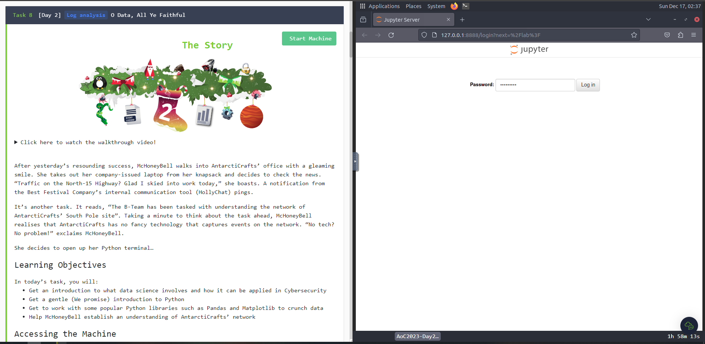

2. Login to Jupyter Notebooks with default password on screen
   * 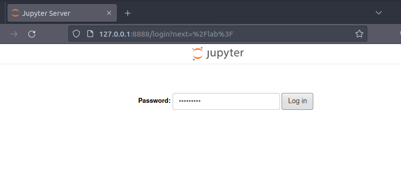

3. Refer task's guide on how to use python with Jupyter Notebooks
   * or additionally you can open 
     * Python 3 Introduction in Jupyter, `1_IntroToPython -> Python3CrashCourse.ipynb`
     * Panda Library Introduction in Jupyter, `2_IntroToPandas ->; IntroToPandas.ipynb`
     * Matplotlib Library Introduction in Jupyter, `3_IntroToMatplotib -> IntroToMatplotlib.ipynb`
   * 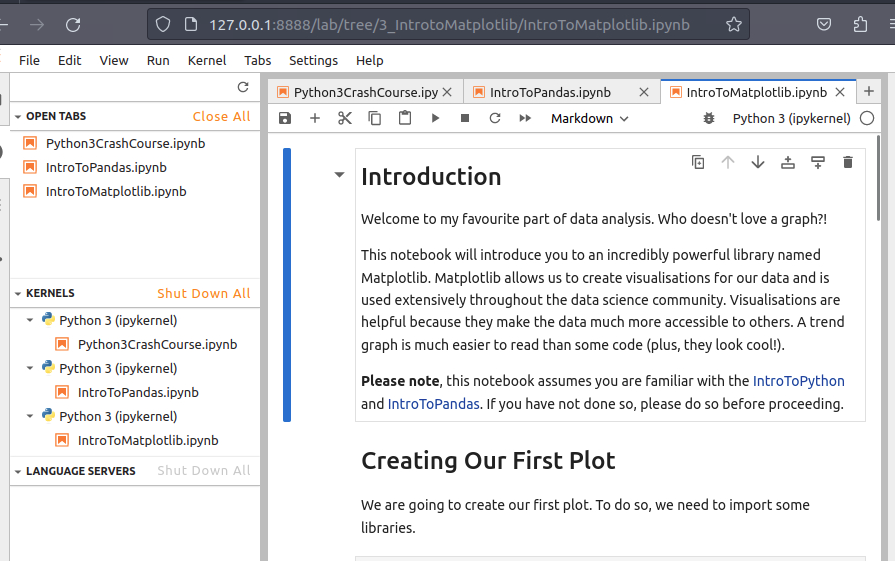

4. Open `Workbook.ipynb` in `4_Capstone` directory
   * 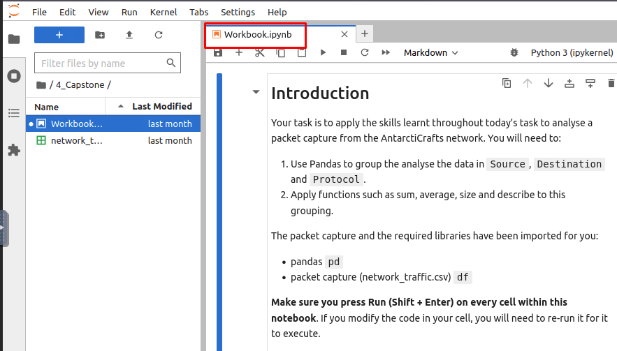

5. The stucture of packet information in cfv file, & required library to run the code.
   * 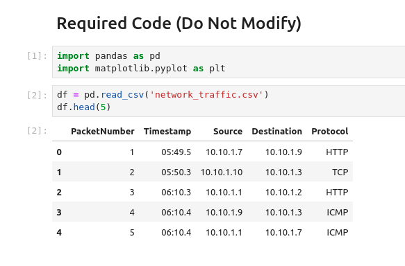

6. Insert a cell to run our code
   * 

7. Copy required codes, select the cell, and try to run the code
   * 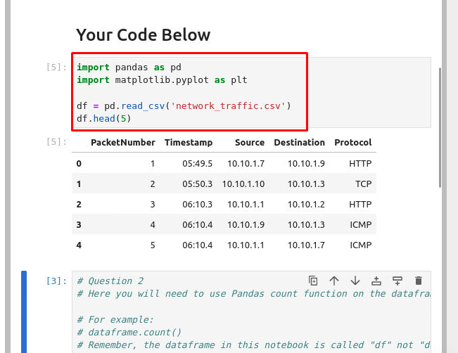
   * 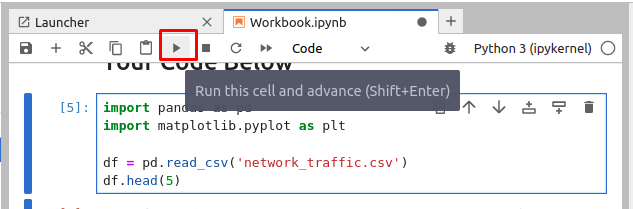
   * 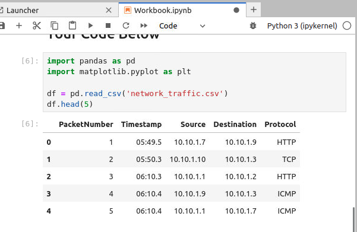

8. Write a code to get total of **PacketNumber**
    ```python
    packet = df.count
    print(packet)
    ```
   * 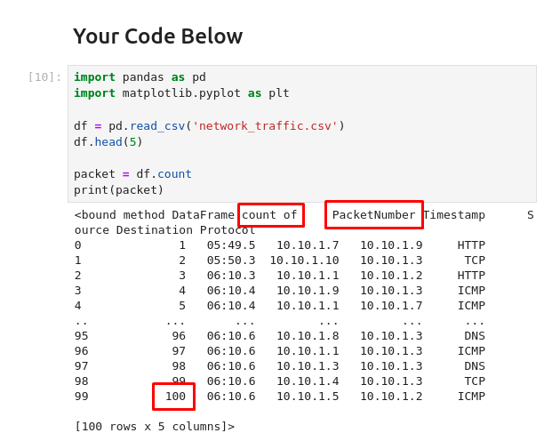
   * Or simply use `df.count()`
     * 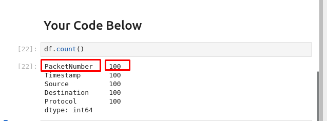
   * **100 Packets** in total 


9. Identify **IP address** with **most traffic (sent)** during packet capture
   * Use `df.groupby(['Source']).size()` code
   * 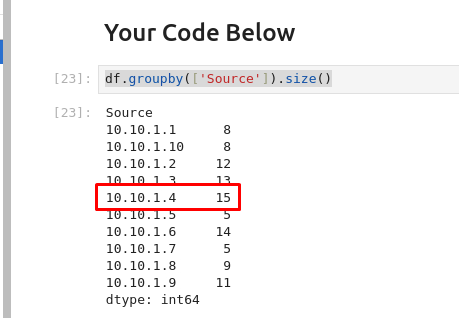
   * `10.10.1.4 `

10. Identify frequent **Protocol** on captured packets
    ```python
    df.groupby(['Protocol']).size().sort_values(ascending=False)  
    ```
   * 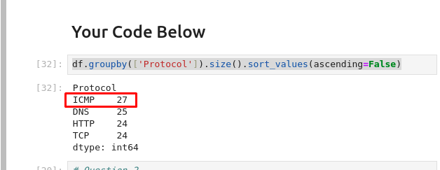

11. Submit all answers obtained 
    * 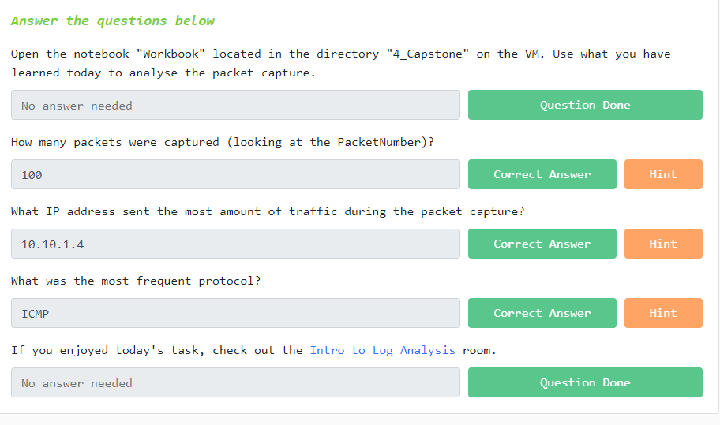