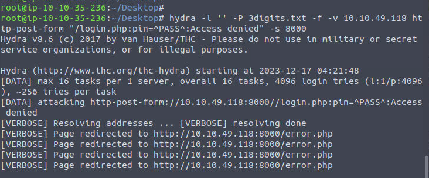

# Day 3 - [Brute-forcing] Hydra is Coming to Town
Additional walktrough [video](https://www.youtube.com/watch?v=UKAchyX7kDY)

## Steps
1. Connect to the TryHackMe's VPN (or use AttackBox)

2. The objective is to brute force PIN to locked Server Room's door
   * 

3. Use `crunch` to generated possible PIN, based on criteria of:
   * Require 
     * **3 digits**
     * Number **0 to 9**, & **A to F** characters. ie, hexadecimal.
   * `crunch 3 3 0123456789ABCDEF -o 3digits.txt`
     * `3` the first number is the minimum length of the generated password
     *` 3` the second number is the maximum length of the generated password
     * `0123456789ABCDEF` is the character set to use to generate the passwords
     * `-o 3digits.txt` saves the output to the **3digits.txt** file
   * 

3. Open pin.php **Page Source** to identify neccesary element information
   * The method is `post`
   * The URL is `http://10.10.49.118:8000/login.php`
   * The PIN code value is sent with the name `pin`
   * 

4. Run hydra in same directory with generated PIN file (to make it easier)
   * `hydra -l '' -P 3digits.txt -f -v 10.10.49.118 http-post-form "/login.php:pin=^PASS^:Access denied" -s 8000`
     * `-l ''` indicates that the login name is blank as the security lock only requires a password
     * `-P 3digits.txt` specifies the password file to use
     * `-f` stops Hydra after finding a working password
     * `-v` provides verbose output and is helpful for catching errors
     * `10.10.49.118` is the IP address of the target
     * `http-post-form` specifies the HTTP method to use
     * `"/login.php:pin=^PASS^:Access denied"` has three parts separated by :
       * `/login.php` is the page where the PIN code is submitted
       *` pin=^PASS^` will replace ^PASS^ with values from the password list
       * `Access denied` indicates that invalid passwords will lead to a page that contains the text “Access denied”
     * `-s 8000` indicates the port number on the target
   * PIN is **`6F5`**
   * 
   * 

5. Use PIN obtained to login
   * WW

6. Press Unlock Door to unlock the server room and get the flag
   * 
   * **`THM{pin-code-brute-force}`**
   * 

7. Submit flag obtained 
    * 