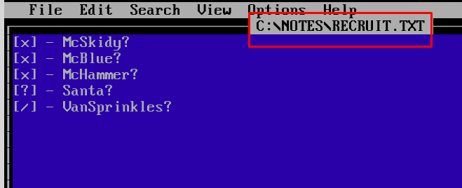

# Day 5: [Reverse engineering] A Christmas DOScovery: Tapes of Yule-tide Past
Additional walktrough [video](https://www.youtube.com/watch?v=wpDvJm9lcO0)


## Steps
1. Start the VM Machine (with DOS) on TryHackMe or use "Remote Desktop" software (linux/Windows) after connect with TryHackMe's VPN
    * 

2. Solve following questions
    * 

3. Enumerate all directories and files are available in the disk
    * 
    * 
    * 
    * 
    * 
    * 
    * 

4. Identify the file size (byte) for ```AC2023.BAK```
    * 

5. Navigate to TOOLS\BACKUP folder to use the backup program
    * 

6. Run ```BUMASTER.EXE C:\AC2023.BAK``` to inspect the backup file
    * Encountered error, need to refer ```readme.txt``` file
    * 
    * 

7. From ```readme.txt``` file, the file's signatures  should begin with ```41 43``` which is ```AC``` in ASCII
    * 
    * Obtained name of backup program as well
        * 

8. ```AC2023.BAK``` begun with ```XX``` ASCII code (```58 58``` in Hex). The file is corrupted (or incompatible)
    * 

9. Edit the file with correct file signatures, and save the file 
    * 

10. Run ```BUMASTER.EXE C:\AC2023.BAK``` again to restore backup
    * Flag obtained, ```THM{0LD_5CH00L_C00L_d00D}```
    * 

11. Submit all answers obtained 
    * 