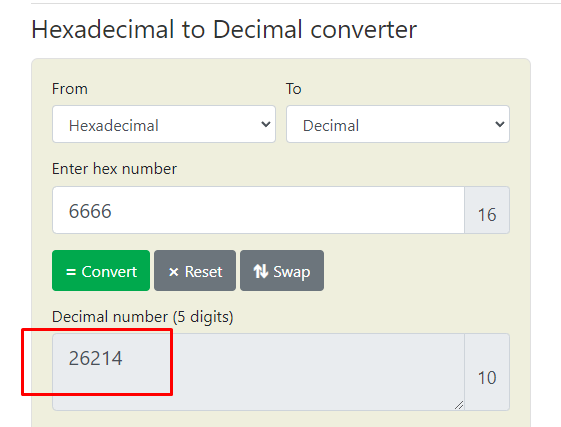
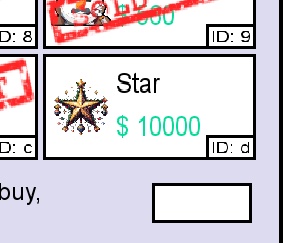

# Day 6: [Memory corruption] Memories of Christmas Past
Additional walktrough [video](https://www.youtube.com/watch?v=ZLG6HhUbU2I)


## Steps
1. Start the Machine on TryHackMe and connect with TryHackMe's VPN
    * 
    * 

2. Solve following questions
    * 

3. For the first question, we only to to read (**convert**) the hexadecimal value of coins to decimal
    * 
    * Since, C++ integers are stored in reverse order inside memory (RAM). Known as the **little-endian** byte order
    * Use converter to change the value of ```53 50 4f 4f```
    * Value of coin is = **1397772111**
    * 

4. To find the final flag, we need to launch the browser game
    * .
    * 

5. Try to play with the game to test (explot) it
    * 

6. Objective of the game is to put a star on the tree, we might find the flag after finished this task
    * 
    * 

7. If we interact with computer in the game, we will get an additional coin
    * 

8. There are two interactable characters in the game
    * 
        * First is Van Holly, we could use him to change the name of our characther 
        * 
        * Second is Van Frosty, he open a store
        * 

9. After talking to Van Frosty, we could see he's selling the star we required to finish the game, it will cost us $10,000 to get it. It would be too long if we're manually get the coin using our interaction with the computer ($1/action)
    * We need to figure out a way to exploit the game
    * 

10. We discover player name via debug panel
    * Take note on amount of coins available on ASCII and Hexadecimal panel
    * 
    * 

11. We can't buy item without enough coins
    * Since this task is a ```buffer overflow``` topic, we try to create to error from something we could control. ie, **Name Changing via Van Holly** 
    * 

12. We need $10,000 to buy a coin, in hexadecimal that amount would be 2710. **10 70** in little-endian
    * 

13. Player name space has 12-bytes space, we need to change the name to 14 characters to occupied the first two bytes of coins memory with our intended value. 
    * Change the name to ```aaaaaaaaaaaaff``` with 14 coins
    * 
    * ```ff``` in hexadecimal is ```66 66```, which is 26,214 in decimal
    * 

14. We changed the name and noticed the coins value changed as well
    * 
    * From the debug panel, we could see the ```ff``` characters of player name overflowed to coins area
    * 
    * 

15. We purchased the star, but still can't talk to tree
  * 
  * 
  * We probably need to overwrite first item with star value.
  * ie, ```e``` in hexadecimal
  * 

16.  Noticed something, star value in shop is **d**, but in debug panel we dont have d item. only **e**
  * We need to overflow all the variables until reachs inventory variable
  * 
  * 

17. There are 44-bytes of space before we reaches inventory variable. Change the name to **45-characters of d**
  * Now we got the star to talk to the tree
  * 

18.  We discover the flag after talked to the tree
  * Flag obtained, ```THM{mchoneybell_is_the_real_star}```
  * 
  * 
  * 

19.  Submit all answers obtained 
  * 