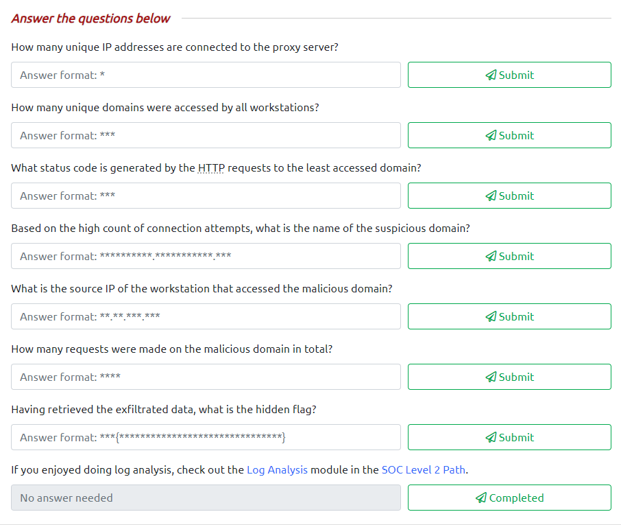
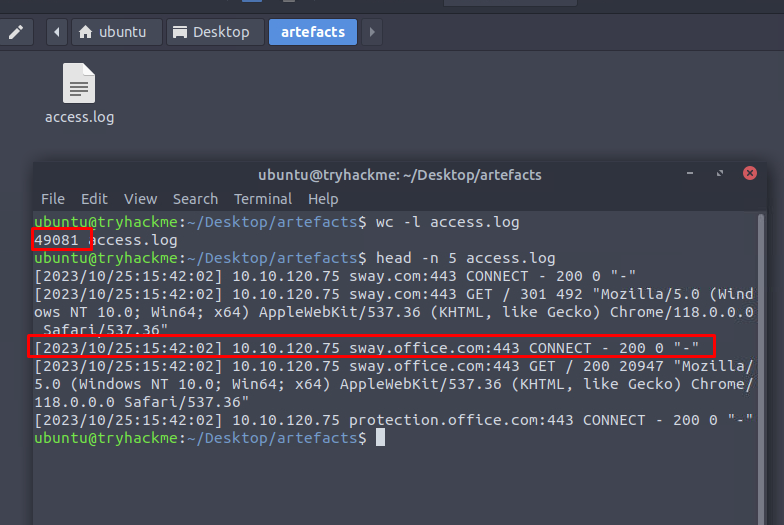
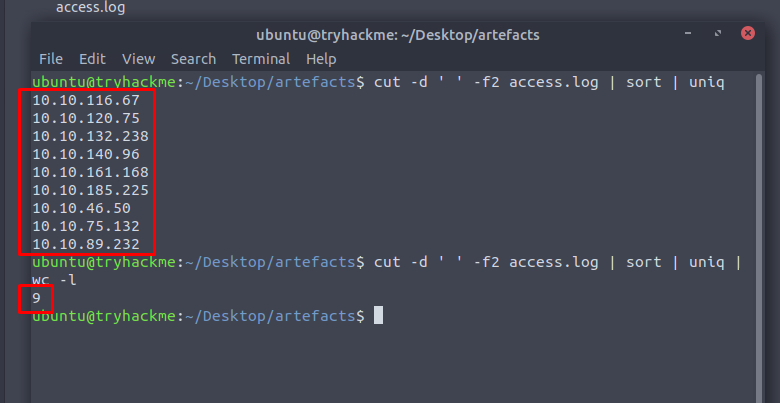
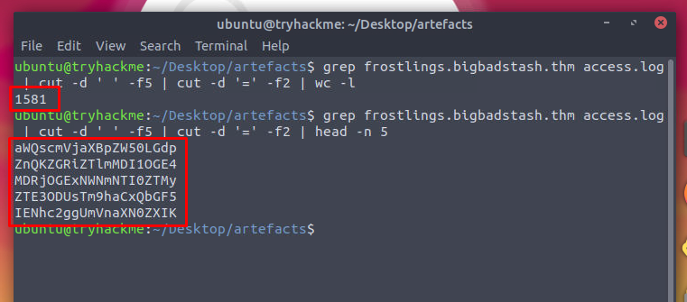
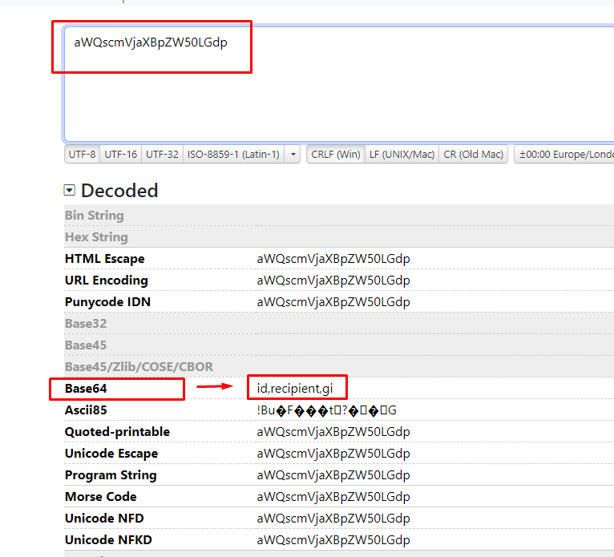
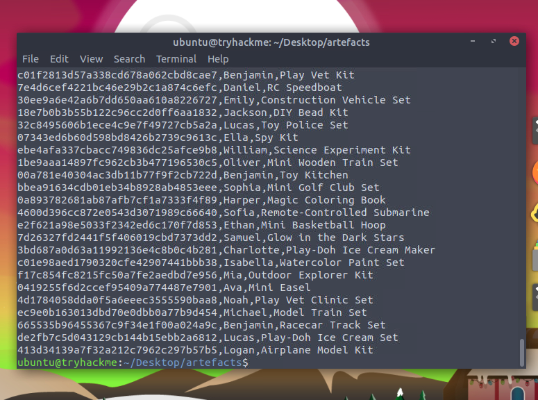
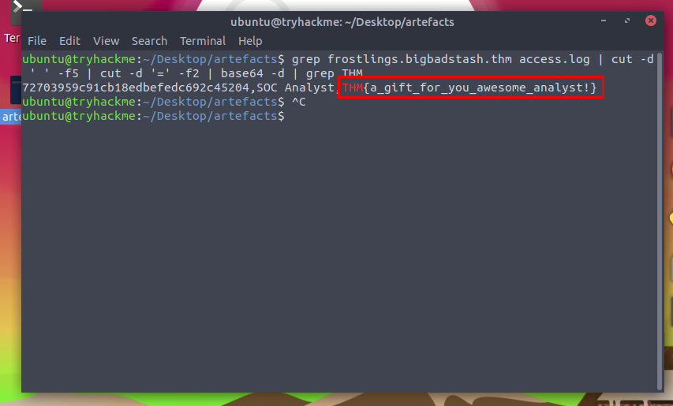
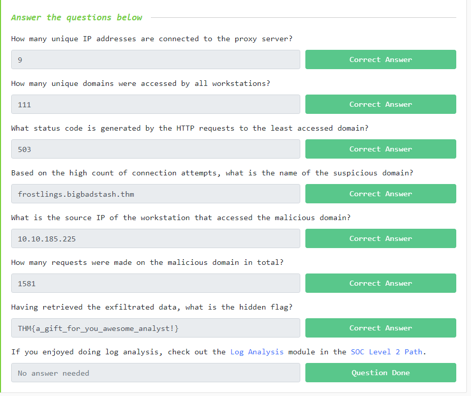

# Day 7: [Log analysis] ‘Tis the season for log chopping!
Additional walktrough [video](https://www.youtube.com/watch?v=cG8UH8xwmaY)


## Steps

1. Read the story about **Tracy McGreedy** incase its contain clue to solving the problem

2. Familiarise with linux command to view file/log, instruction in the room for Day 7 task
   * ```cat```, ```less```, ```head```, ```tail```, ```wc```, ```nl``` 

3. Press the "Start Machine" button to initiate the AttackBox
    * 

4. Solve following questions
    * 

5. Take a look at content of the log file in  ```/home/ubuntu/Desktop/artefacts``` directory
    * Identify the log format/schema to make sifting through  **49,081 lines** of log easier
    * 

6. First task, identify **unique IP addresses** in the log
    * use ```cut -d ' ' -f2 access.log | sort | uniq | wc -l```
      * ```cut``` | Split the log entries per column base on delimiter
      * ```-d ' '``` | delimiter for cut command, uses space (' ') as its delimiter
      * ```-f2``` | position of the columns splitted
      * ```sort``` | sort the lines of text files or input streams in ascending or descending order
      * ```uniq``` | filter out and display unique lines from a **sorted** file or input stream
         *  requires a sorted list to be effective because it only compares the adjacent lines
      * ```wc -l``` | word count, by default, it prints the count of lines, words, and characters
        * ```-l``` display the line count only
    * 


----

1. Navigate to TOOLS\BACKUP folder to use the backup program
    * 

2. Run ```BUMASTER.EXE C:\AC2023.BAK``` to inspect the backup file
    * Encountered error, need to refer ```readme.txt``` file
    * 
    * 

3.  From ```readme.txt``` file, the file's signatures  should begin with ```41 43``` which is ```AC``` in ASCII
    * 
    * Obtained name of backup program as well
        * 

4.  ```AC2023.BAK``` begun with ```XX``` ASCII code (```58 58``` in Hex). The file is corrupted (or incompatible)
    * 

5.  Edit the file with correct file signatures, and save the file 
    * 

6.  Run ```BUMASTER.EXE C:\AC2023.BAK``` again to restore backup
    * Flag obtained, ```THM{0LD_5CH00L_C00L_d00D}```
    * 

7.  Submit all answers obtained 
    * 