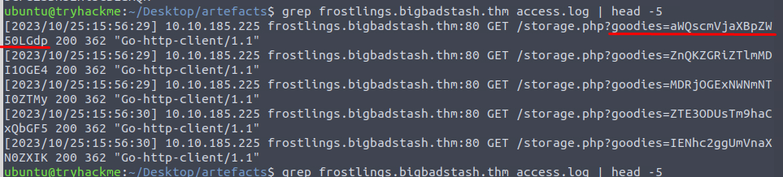

# Day 7: [Log analysis] ‘Tis the season for log chopping!
Additional walktrough [video](https://www.youtube.com/watch?v=cG8UH8xwmaY)


## Steps

1. Read the story about **Tracy McGreedy** incase its contain clue to solving the problem

2. Familiarise with linux command to view file/log, instruction in the room for Day 7 task
   * ```cat```, ```less```, ```head```, ```tail```, ```wc```, ```nl``` 

3. Press the "Start Machine" button to initiate the AttackBox
    * 

4. Solve following questions
    * 

5. Take a look at content of the log file in  ```/home/ubuntu/Desktop/artefacts``` directory
    * Identify the log format/schema to make sifting through  **49,081 lines** of log easier
    * 

6. First task, identify **unique IP addresses** in the log
    * use ```cut -d ' ' -f2 access.log | sort | uniq | wc -l```
      * ```cut``` | Split the log entries per column base on delimiter
        * ```-d ' '``` | delimiter for cut command, uses space (' ') as its delimiter
        * ```-f2``` | position of the columns splitted
      * ```sort``` | sort the lines of text files or input streams in ascending or descending order
      * ```uniq``` | filter out and display unique lines from a **sorted** file or input stream
         *  requires a sorted list to be effective because it only compares the adjacent lines
      * ```wc -l``` | word count, by default, it prints the count of lines, words, and characters
        * ```-l``` display the line count only
    * 

7. Second task, identify total of **unique domains** accessed by all workstations
   * use ```cut -d ' ' -f3 access.log | cut -d ':' -f1 | sort | uniq | wc -l```
      * ```cut``` | Split the log entries per column base on delimiter
        * ```-d ' '``` | delimiter for cut command, uses space (' ') as its delimiter
        * ```-f3``` | position of the columns splitted
        * ```-d ':'``` | Delimeter to remove port number, same domain accessed by different ports
      * ```sort``` | sort the lines of text files or input streams in ascending or descending order
      * ```uniq``` | filter out and display unique lines from a **sorted** file or input stream
         *  requires a sorted list to be effective because it only compares the adjacent lines
      * ```wc -l``` | word count, by default, it prints the count of lines, words, and characters
        * ```-l``` display the line count only
    * 

8. Third task, identify status code generated by **least accessed domain**
   * Identify least accessed domain using ```cut -d ' ' -f3 access.log | cut -d ':' -f1 | sort | uniq -c | sort -n | head -n 5```
     * **partnerservices.getmicrosoftkey.com** acccessed 78 times
     * ```-c``` | Counter for ```uniq``` command
     * ```-n``` | re-sort the list again based on ```count``` command
     * ```head -n 5``` | display top five of sorted list
     * 
   * Use grep function with cut like above to display all status code for this domain
     * ```grep partnerservices.getmicrosoftkey.com access.log | cut -d ' ' -f6 | sort | uniq```
     * 

9. Fourth task, identify **suspicious domain** based on the **high count of connection** attempts
   * Use ```cut -d ' ' -f3 access.log | cut -d ':' -f1 | sort | uniq -c | sort -nr | head -n 10```
     * ```sort -nr``` | re-sort the list again, ```-r``` for descending order
     * **frostlings.bigbadstash.thm**
     * 

10. Fifth task, identify **source IP** accessed the malicious domain
   * Use grep command, ```grep frostlings.bigbadstash.thm access.log | cut -d ' ' -f2 | sort | uniq```
     * 10.10.185.225
     * 

10. Sixth task, identify how many **request** were made to **malicious domain**
   * Use number of connection stated when doing fouth task, **1581**

11. Seventh and final task, find flag in the exfiltrated data
   * See what was logged when an IP acccesed that domain
     * Something unusual with the string passed to the ```goodies``` parameter
       * 
     * Filter the log using ```grep frostlings.bigbadstash.thm access.log | cut -d ' ' -f5 | cut -d '=' -f2 | head -n 5```
       * ```-d '='``` | delimit the content after ```goodies``` parameter
       * There are **1581** lines
       * 
   * Identify what is the type of string passed to ```goodies``` parameter  
     * Seem like it was encoded using base64 from internet [tool](https://dencode.com/)
     * 
   * Find flag from converted string
     * 
   * The list is too long to find it manually, use grep function to find something related to THM's flag
     * ```grep frostlings.bigbadstash.thm access.log | cut -d ' ' -f5 | cut -d '=' -f2 | base64 -d | grep THM```
     * **THM{a_gift_for_you_awesome_analyst!}**
     * 

12.  Submit all answers obtained 
     * 