# Day 8: [Disk forensics] Have a Holly, Jolly Byte!
Additional walktrough [video](https://www.youtube.com/watch?v=7wB0HNf1qh4)


## Steps
1. Read the story about **Tracy McGreedy**, & **Van Sprinkles** incase its contain clue to solving the problem

2. Familiarise with **FTK Imager** tools as written in Day 8 task

3. Press the "Start Machine" button to initiate the AttackBox
    * 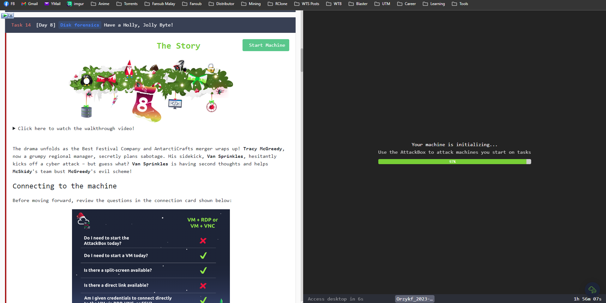
  
4. Solve following questions
    * 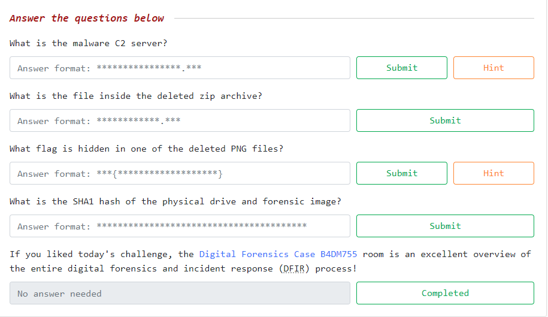

5. Run **FTK Imager**
    * 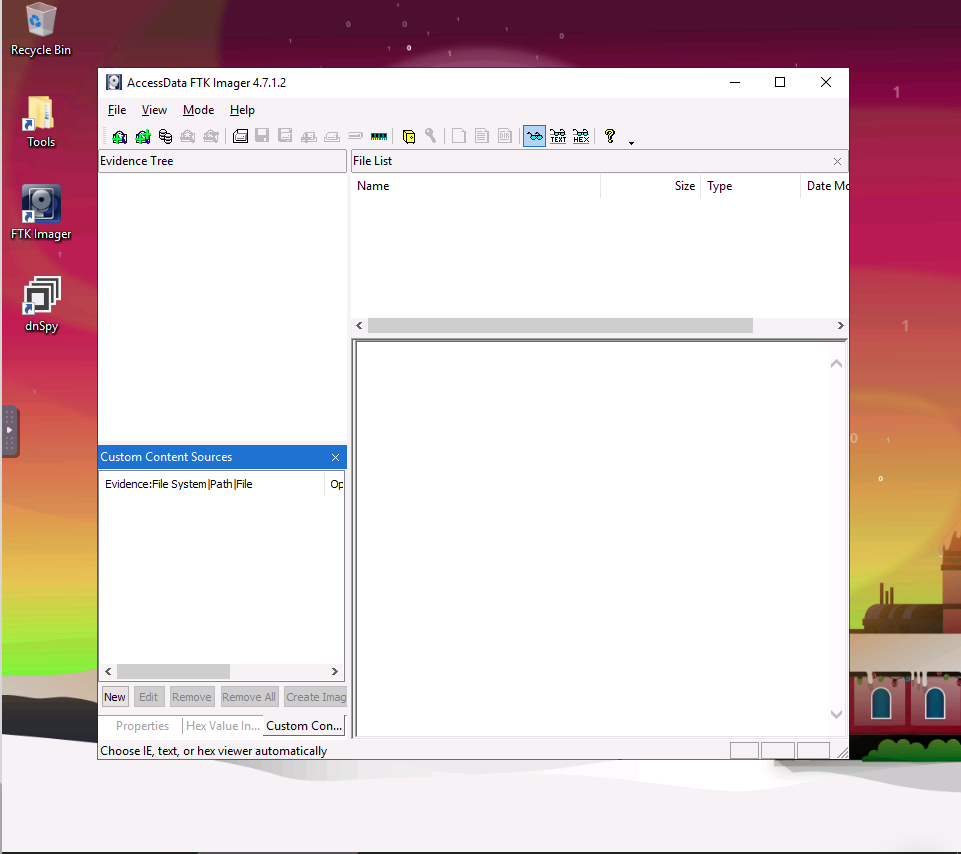

6. Select emulated USB drive TryHackMe create   
    * ```\\PHYSICALDRIVE2 - Microsoft Virtual Disk [1GB SCSI]```
    * 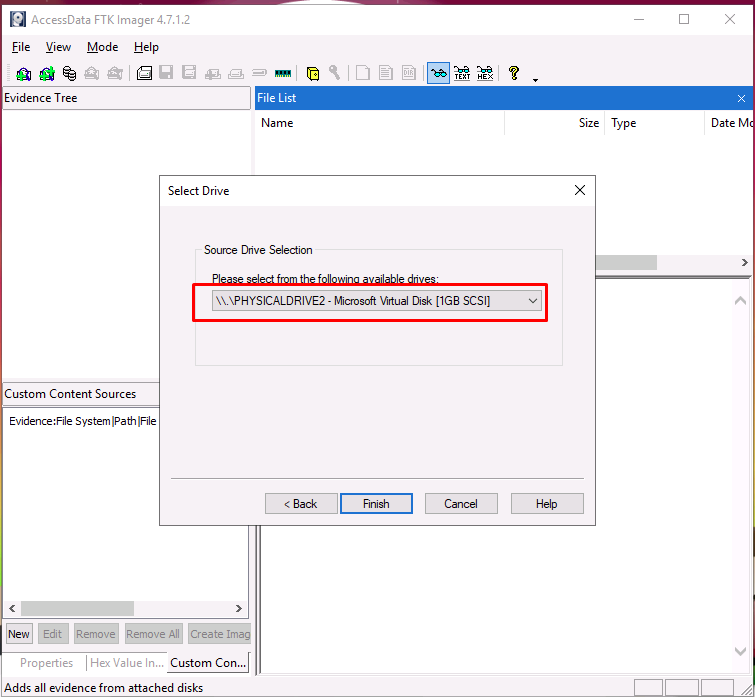

7. Navigate through FTK Imager's **evidence tree** to find useful information
    * 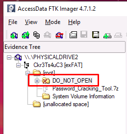

8. Open .txt file and read the chat/messages in it to find hidden details
    * Details we obtained:
      * Payload under `JuicyTomaTOY_final.zip`
      * `JuicyTomaTOYDownloader.exe` is the malicious executable file user/actor need to run on their computer
      * **Gr33dYsH4d0W (Tracy McGreedy?)** use offshore server, untraceable if got caught. 
    * 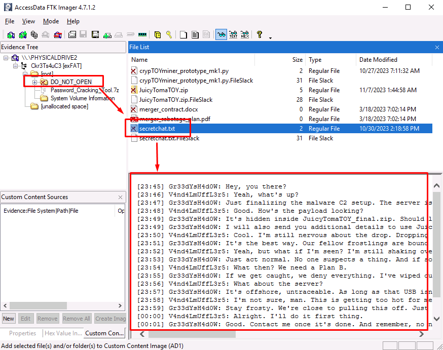

9.  Obtain answer for the first question, **what is C2 server?**
    * `mcgreedysecretc2.thm`
    * 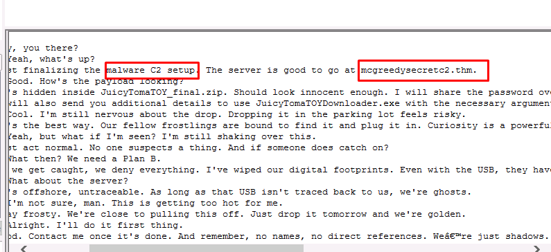

10. Open `JuicyTomaTOY_final.zip` to see what is the content inside, use it to answer second question.
    * `JuicyTomaTOY.exe`
    * 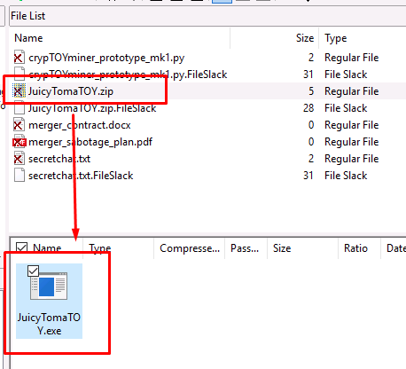

11. Find deleted image file, open in hex mode, and search for THM's flag format.
    * eg, `THM{`
    * 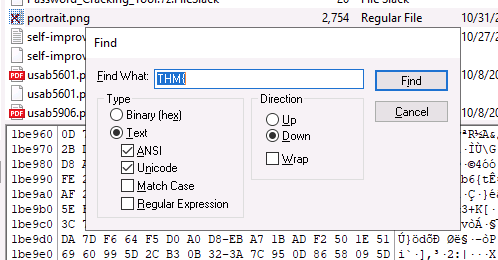
    * Keyword searched got a match on portrait.png file
    * Flag obtained, hidden in hexadecimal code. `THM{byt3-L3vel_@n4Lys15}`
      * 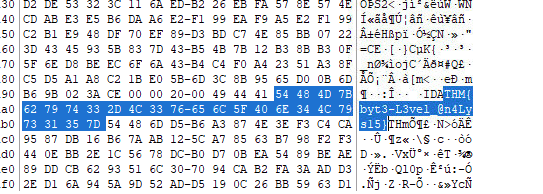

12. For final question, we need to verffy the integrity (checksum) of the physical drive and obtain the SHA1 number calculated
    * Click the physical drive
      * 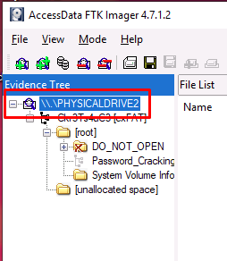  
    * Click `**File > Verify Drive/Image**`
      * 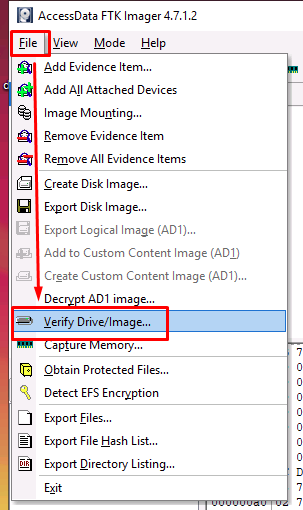
    * Wait for the process to finish, processing time depend on the file/drive size. **Larger = longer**.
      * 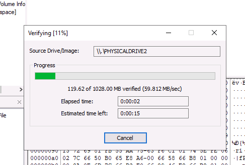 
    * Copy the SHA1 calculated number
      * 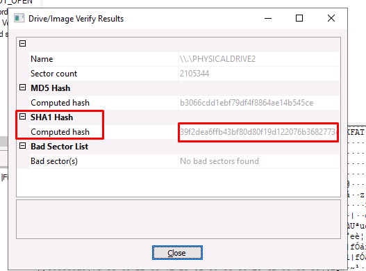  

13. Submit all answers obtained 
    * 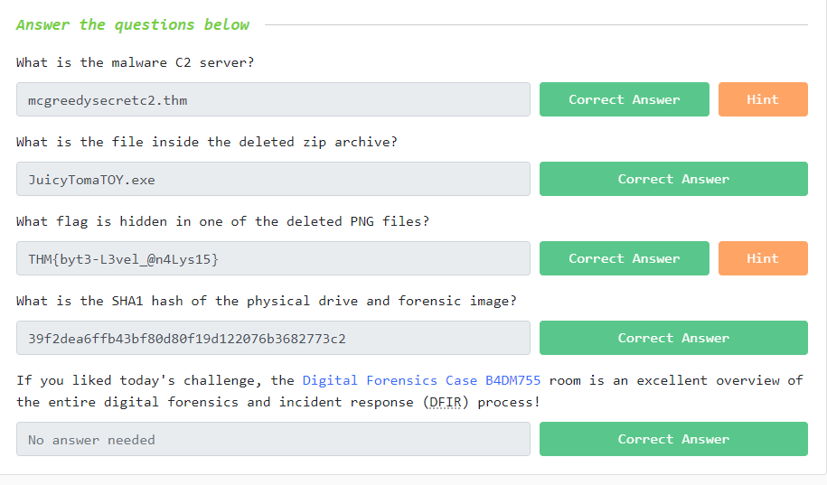