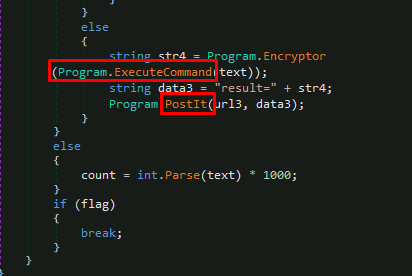

# Day 9: [Malware analysis] She sells C# shells by the C2shore
Additional walktrough [video](https://www.youtube.com/watch?v=aHKTfJJ3I5k)

## Steps
1. Start the VM Machine (Windows) on TryHackMe or use "Remote Desktop" software (linux/Windows) after connect with TryHackMe's VPN
    * 

2. Solve following questions
    * 

3. Open malware sample file (`JuicyTomaTOY_defanged`) using dnSpy application
    * Go to this directory, `C:\Users\analyst\Desktop\artefacts`
    * 

4. Click main function of the program to read the code.
    * 

5. Read the `Main` function code to understand the `Malware Execution Pipeline`
    * 

6. Find **HTTP User-Agent** this malware use
    * Read through the code or alternatively, read the programm class individually
      * 
    * Found one class with User-Agent specified in **`GetIt`** function
      * **`Mozilla/5.0 (Macintosh; Intel Mac OS X 14_0) AppleWebKit/605.1.15 (KHTML, like Gecko) Version/17.0 Safari/605.1.15`**
      * 

7. Find **HTTP method** used to command execution output
    * In  `ExecuteCommand` section, the program  initialize `PostIt` function
      * 
    * open `PostIt` function, it show that this function will use **`POST`** HTTP method
      * 

8. To find key this malware used to encrypt/decrypt the C2 data, open either `Encryptor` or `Decrypt` function
    * **`youcanthackthissupersecurec2keys`**
    * 

9. To find the first HTTP URL used by the malware, we need to take a look at `Main` function again
    * The URL variable combined both str (`http://mcgreedysecretc2.thm`) variable with "`/reg`" string, **`http://mcgreedysecretc2.thm/reg`**
    * 

10. Hardcoded time interval (in seconds) also available at `Main` function
    * The number is in milliseconds, change it to seconds = **15**
    * 

11. For C2 command attacker use to execute cmd.exe, refer to `Main` function
    * If the string input = `shell`, the program will execute else statement.
    * Which will execute `Encryptor` & `ExecuteCommand` functions
    * 

12. Domain use by attacker to download another binary is **`stash.mcgreedy.thm`**
    * 

13. Submit all answers obtained 
    * 